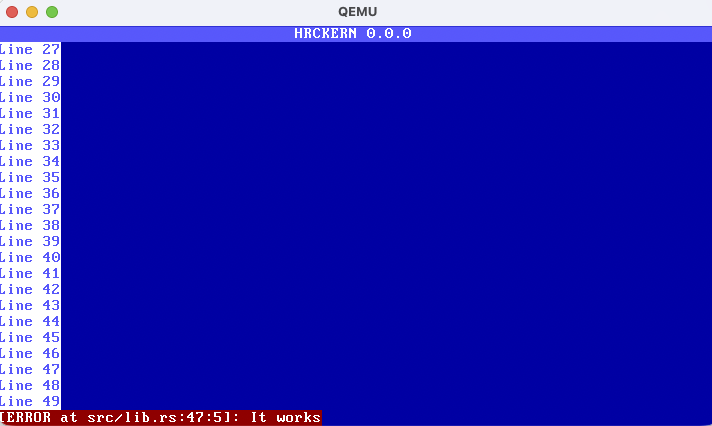

# hrckern

A minimal operating system kernel written in Rust.  
Inspired by [Writing an OS in Rust](https://os.phil-opp.com/).

---

## Overview

`hrckern` is a simple kernel targeting the **x86_64** architecture and running in **long mode**.  
The project serves as an educational implementation of a basic OS kernel using Rust, focusing on modularity, low-level concepts, and safety guarantees where possible.

---

## Goals

- Understand the fundamentals of OS boot and execution flow  
- Implement kernel subsystems from scratch using Rust  
- Provide a clean, modular, and educational codebase

---

## System Requirements

- **Processor architecture:** x86_64  
- **Rust toolchain:** `nightly-2024-05-07` or later (`rustc >= 1.92.0-nightly`)  
- **QEMU:** `>= 10.1.0`  
- **make** and **Docker** (for containerized builds)

---

## Project Structure

```text
hrckern/
├── Cargo.toml           # Rust project manifest
├── Makefile             # Build and run commands
├── bootloader/          # Bootloader setup and multiboot headers
├── src/                 # Core kernel logic (entry, memory, interrupts, etc.)
│   ├── lib.rs
│   ├── vga_buffer.rs    # TTY driver implementation
│   ├── interrupts.rs    # Interrupt descriptor table (WIP)
│   └── ...
```

---

## Features

### Bootloader
- [x] Multiboot-compliant header
- [x] Long mode entry point
- [x] Simple initialization sequence

### TTY (Text Output)
- [x] Character and string output
- [x] Line breaks and scrolling
- [x] Foreground/background color control
- [x] `format!` and `println!` macros
- [x] Cursor positioning

### Interrupts (Work in Progress)
- [ ] Interrupt Descriptor Table (IDT)
- [ ] Hardware IRQ support  
  - [ ] Keyboard  
  - [ ] Mouse  

### Memory Management (Planned)
- [ ] Frame allocator
- [ ] Page tables
- [ ] Heap allocator

## Building and Running

All steps are containerized using Docker — no toolchain installation required.

### 1. Build the Docker image
```bash
make build-env
```

### 2. Build and run the kernel
```bash
make
```

This command will:
1. Compile the kernel in release mode
2. Generate a bootable ISO image
3. Launch the kernel in QEMU

## Example output



## Development Notes

- The kernel currently does not use the standard Rust library (`#![no_std]`).
- All interactions with hardware (e.g., VGA text buffer) occur via memory-mapped I/O.
- The project will later introduce paging, a heap allocator, and a minimal scheduler.
- Debugging is primarily performed via QEMU’s serial console and GDB.

## References
- [Writing an OS in Rust](https://os.phil-opp.com/)
- Intel® 64 and IA-32 Architectures Software Developer’s Manual
- [OSDev Wiki](https://wiki.osdev.org/Main_Page)
- [The Embedded Rust Book](https://docs.rust-embedded.org/book/)
