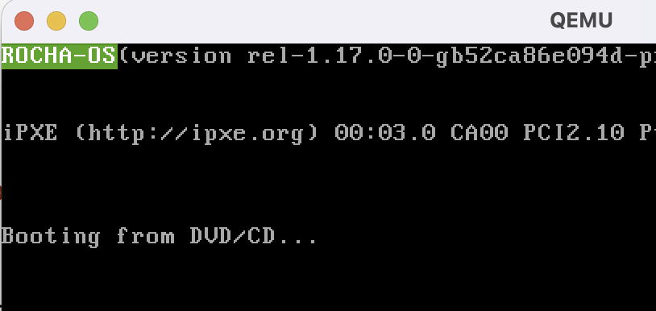

# hrckern

Kernel simples feito em Rust. Baseado no livro [Writing an OS in Rust](https://os.phil-opp.com/).

# Dependências
- `qemu v10.1.0`
- `rust v1.92.0-nightly`

# Importante
- O código é desenvolvido sobre a arquitetura x86

# TODO
- [ ] Implementar bootloader com suporte a multiboot e long mode
- [ ] Buffer VGA
- [ ] Interrupções
- [ ] UEFI e ACPI

# Montando o bootloader
Precisamos das ferramentas, em um SO Linux x86:
- `nasm`
- `grub2-common`
- `grub-pc-bin` (para suporte EFI)
- `make`
- `xorriso`

```bash
sudo apt update && sudo apt install nasm grub2-common grub-pc-bin make xorriso -y
```

Acessar o diretório `bootloader` e executar o comando `make`. Ele gerará a imagem `hrckern.iso`.

### Execução do bootloader
Ele ainda não mapeia para o kernel, mas é possível carregar o bootloader *multiboot compliant*

```bash
qemu-system-x86_64 -boot d -cdrom bootloader/hrckern.iso
```

Exemplo:
